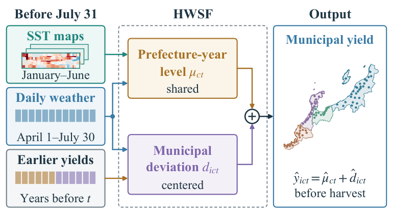
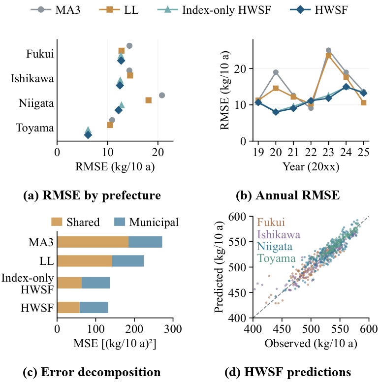
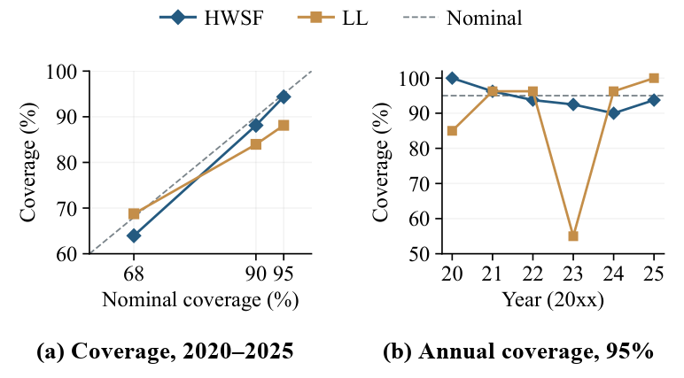
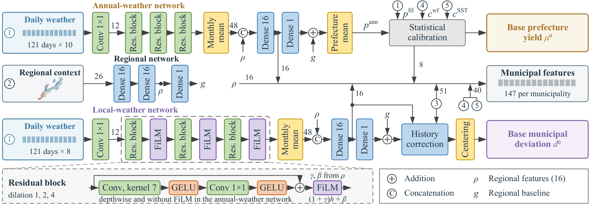
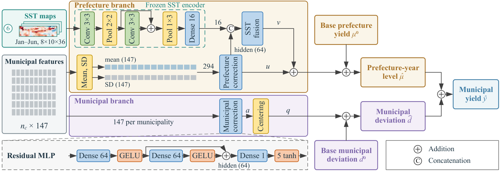
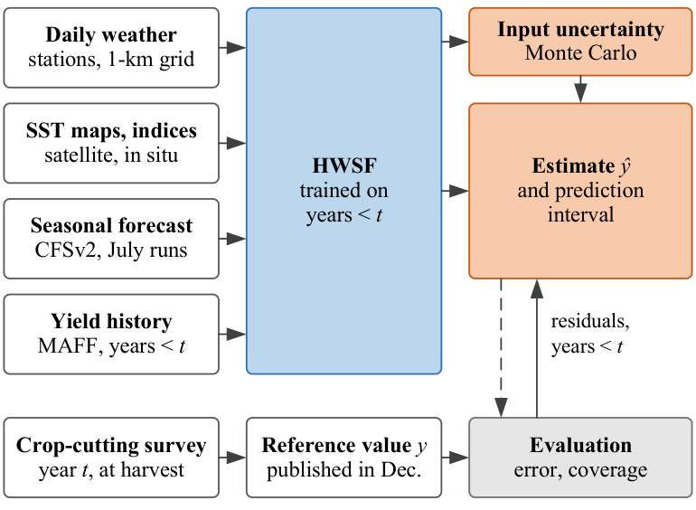

<div align="center">

# HWSF: Hierarchical Weather–SST Fusion

**Preharvest municipal rice yield estimation with hierarchical weather and sea surface temperature fusion and uncertainty quantification**

[Project page](https://boukuhaku.github.io/hwsf-rice-yield/) ·
[Pretrained models](https://github.com/boukuhaku/HWSF/releases) ·
[Documentation](docs/) ·
[Citation](#citation)

  



</div>

HWSF estimates the rice yield (kg/10 a) of every municipality at the end of July, before the official municipal
statistics are published after the harvest. It combines daily weather, regional climate, recent yield history,
seasonal forecasts, and ocean information, and it reports an uncertainty for each estimate.

- **Hierarchical prediction.** The yield of municipality *i* in prefecture *c* and year *t* is split into a
  prefecture-year level and a centered municipal deviation, $\hat y_{ict}=\hat\mu_{ct}+\hat d_{ict}$, which are
  predicted by separate branches.
- **SST-map pathway.** A convolutional SST encoder, pretrained by masked reconstruction on historical SST anomaly
  maps, supplies 16 SST-map features to an SST fusion network that corrects the prefecture-year level.
- **Uncertainty evaluation.** Monte Carlo propagation of input uncertainty through the trained model gives the input
  standard uncertainty of each estimate; residuals of earlier years calibrate the prediction intervals.
- **Annual refitting.** For every target year the model is refitted with the records of earlier years only and reads
  only inputs available before July 31, 00:00 JST.

## Results

Retrospective evaluation with annual refitting on 80 municipalities in Fukui, Ishikawa, Niigata, and Toyama
(560 municipality-year records, 2019–2025). Errors in kg/10 a; bias means estimate minus observation.

| Group | Method | RMSE | MAE | Bias | R² |
|---|---|---:|---:|---:|---:|
| Historical | MA3 (three-year moving average) | 16.489 | 12.249 | +0.927 | 0.747 |
| | LL (local-level model) | 14.980 | 11.000 | +1.464 | 0.791 |
| | LL-WC (LL with weather correction) | 15.052 | 11.186 | +1.441 | 0.789 |
| Machine learning | RF | 17.131 | 13.202 | −1.829 | 0.727 |
| | XGBoost | 17.076 | 13.212 | −2.026 | 0.729 |
| Neural | Direct network | 16.951 | 13.681 | −0.049 | 0.733 |
| | Single residual network | 12.096 | 9.123 | +1.239 | 0.864 |
| | Index-only HWSF (without the SST-map pathway) | 11.731 | 8.962 | −0.606 | 0.872 |
| | **HWSF** | **11.495** | **8.769** | **−0.290** | **0.877** |

Prediction intervals for the 480 records of 2020–2025 (calibrated with the residuals of earlier years):

| Nominal | Method | Coverage | Mean width | Interval score |
|---|---|---:|---:|---:|
| 95% | **HWSF** | **94.4%** | **39.7** | **58.6** |
| | LL | 88.1% | 52.2 | 95.8 |
| 90% | **HWSF** | **88.1%** | **33.3** | **48.5** |
| | LL | 84.0% | 43.8 | 76.5 |
| 68% | **HWSF** | **64.0%** | **20.1** | **34.4** |
| | LL | 68.8% | 26.5 | 47.9 |

<p align="center">
  
  
</p>

The estimates, input standard uncertainties, and prediction intervals of all records are in [`results/`](results/);
`python scripts/evaluate.py` and `python scripts/intervals.py` recompute both tables from them.

## Model



**Base predictions.** A regional network maps 26 inputs (latitude, longitude, and the historical April–July monthly
means of six weather variables) to a 16-element regional representation and a scalar regional baseline. An annual-weather network (depthwise temporal convolutions) and a local-weather
network (full-channel temporal convolutions with FiLM regional conditioning) read the daily weather from April 1 to
July 30. The base prefecture yield combines the annual-weather prediction with a fixed-filter prediction, a
weather-and-forecast correction, and an SST-index correction,

$$\mu^0_{ct}=0.875\,p^{\mathrm{ann}}_{ct}+0.125\,p^{\mathrm{fil}}_{ct}+0.25\,c^{\mathrm{wf}}_{ct}+0.75\,c^{\mathrm{SST}}_{t},$$

and the centered base municipal deviation combines the local-weather prediction with a learned history correction
based on the residuals of the three preceding reference years.



**Hierarchical correction.** Each municipality is described by 147 features. The prefecture correction network reads
their mean and standard deviation within the prefecture-year (294 values); the municipal correction network reads each
municipality's own features, and its output is centered within the prefecture-year. In the SST-map pathway, the SST
fusion network combines the prefecture hidden representation with the SST-map features and adjusts the prefecture
level again:

$$\hat\mu_{ct}=\mu^0_{ct}+u_{ct}+v_{ct},\qquad \hat d_{ict}=d^0_{ict}+q_{ict}.$$

The final estimate averages six independently initialized weather members. Within each member, the prefecture and
municipal corrections are averaged over five initializations each, and the SST encoding and fusion over ten
initializations (1,777,262 network parameters in total).



**Uncertainty evaluation.** Four input sources are perturbed in a Monte Carlo simulation with 1024 draws per target
year: the spatial representativeness of the weather inputs, the OISST error, and the reporting resolution of the SST
indices and of the reference-year yields. The SD of the draws is the input standard uncertainty $u^{\mathrm{in}}$. The
interval of each record is $\hat y\pm z_{1-\alpha/2}\,\sigma_t\,\kappa$ with $\kappa=\max(u^{\mathrm{in}},1)$ and
$\sigma_t$ the root mean square of the scaled errors of the earlier evaluation years.

## Installation

```bash
git clone https://github.com/boukuhaku/HWSF.git
cd HWSF
pip install -e .            # Python >= 3.10, PyTorch >= 2.0, NumPy, SciPy, pandas
```

A CUDA GPU is optional; inference and the Monte Carlo propagation also run on the CPU.

## Pretrained models

One checkpoint per target year, each fitted with the records of the years before it:

| Target year | Training years | Checkpoint |
|---|---|---|
| 2019 | 2008–2018 | `hwsf_2019.pt` |
| 2020 | 2008–2019 | `hwsf_2020.pt` |
| 2021 | 2008–2020 | `hwsf_2021.pt` |
| 2022 | 2008–2021 | `hwsf_2022.pt` |
| 2023 | 2008–2022 | `hwsf_2023.pt` |
| 2024 | 2008–2023 | `hwsf_2024.pt` |
| 2025 | 2008–2024 | `hwsf_2025.pt` |

Download them from the [release page](https://github.com/boukuhaku/HWSF/releases) or with
`python scripts/download_checkpoints.py`. They reproduce the published estimates of all 560 records to within
1e-5 kg/10 a.

## Quick start

```python
from hwsf import HWSF
from hwsf.training import load_dataset
from hwsf.training.dataset import target_year_inputs

model = HWSF.from_checkpoint("checkpoints/hwsf_2025.pt")          # add device="cuda" to use a GPU
inputs = target_year_inputs(load_dataset("data/dataset.npz"), 2025)  # see docs/data.md and docs/training.md
out = model.predict(inputs, return_components=True)
out["estimate"]                 # municipal estimates (kg/10 a), in the municipality order of the model
out["prefecture_level"]         # predicted prefecture-year levels
out["municipal_deviation"]      # predicted municipal deviations (centered within each prefecture)
out["base_prefecture_yield"]    # base prefecture yield of each weather member, and the other components
```

Input standard uncertainty by Monte Carlo propagation:

```python
from hwsf import uncertainty

sources = uncertainty.load_sources("data/uncertainty_2025.npz")    # representativeness and OISST error SDs
mc = uncertainty.propagate(model, inputs, sources, draws=1024)
mc["input_standard_uncertainty"]                                    # u_in of each municipality
```

Command-line tools:

```bash
python scripts/download_checkpoints.py --output checkpoints
python scripts/predict.py --checkpoint checkpoints/hwsf_2025.pt --dataset data/dataset.npz --year 2025 --output estimates_2025.csv
python scripts/propagate.py --checkpoint checkpoints/hwsf_2025.pt --dataset data/dataset.npz --year 2025 \
    --sources data/uncertainty_2025.npz --draws 1024 --output u_in_2025.csv
python scripts/evaluate.py      # errors of the published estimates in results/
python scripts/intervals.py     # prediction intervals and their coverage
```

## Data

HWSF reads only information available before the cutoff of July 31, 00:00 JST. Apart from the MAFF yields of the
evaluation records in [`results/`](results/), the source data are not redistributed here; [docs/data.md](docs/data.md)
describes how to obtain them and the expected input format.

| Input | Provider |
|---|---|
| Municipal rice yields (reference values) | Ministry of Agriculture, Forestry and Fisheries of Japan (MAFF), crop statistics |
| Daily weather (1-km grid, one representative point per municipality) | NARO agro-meteorological grid data (registration required) |
| SST maps | NOAA OISST v2.1 |
| SST indices | NOAA CPC (Niño 1+2, 3, 4, 3.4), JMA (NINO.WEST) |
| Seasonal forecasts | NCEP CFSv2, July runs |
| Prefecture weather for fitting the SST-index correction | NASA POWER |

## Training

`scripts/train.py` refits HWSF for each target year following the three stages of Algorithm 1 in the paper: base
networks and historical features, the prefecture and municipal correction networks, and the SST encoder pretraining
and SST fusion networks. The origins are fitted in increasing order from 2012, because later origins use the
predictions that earlier origins made for their own year; see [docs/training.md](docs/training.md). Retraining all
origins from scratch takes about 40 minutes on a laptop GPU and reproduces the released estimates to within
0.16 kg/10 a (RMSE 11.500 versus 11.495 kg/10 a; [docs/reproduce.md](docs/reproduce.md)).

```bash
python scripts/prepare_dataset.py ... --output data/dataset.npz        # from the source data, see docs/data.md
python scripts/train.py --dataset data/dataset.npz --target-years 2019 2020 2021 2022 2023 2024 2025 --output runs/hwsf
```

## Repository structure

```
hwsf/
  nn/networks.py      regional, annual-weather, local-weather (FiLM), history, correction, and SST networks
  calibration.py      fixed-filter prediction, weather-and-forecast correction, SST-index correction
  model.py            HWSF for one target year: base predictions, hierarchical correction, SST-map pathway
  data.py             daily weather channels, weather summaries, model inputs
  prepare.py          preparation of the inputs from the source data
  uncertainty.py      Monte Carlo propagation of input uncertainty and prediction intervals
  evaluation.py       RMSE, MAE, bias, R^2, and the MSE decomposition
  training/           training dataset, fitting routines, and the annual refitting of Algorithm 1
scripts/              prepare_dataset, train, predict, propagate, evaluate, intervals, download_checkpoints
results/              estimates, input standard uncertainties, and prediction intervals of the evaluation records
docs/                 data, model, training, and reproduction notes
tests/                unit tests on synthetic inputs
```

## Citation

If you use this code, please cite the paper (manuscript under review):

```bibtex
@article{hwsf,
  title   = {Preharvest Municipal Rice Yield Estimation With Hierarchical Weather and Sea Surface Temperature Fusion and Uncertainty Quantification},
  note    = {Manuscript under review},
  year    = {2026}
}
```

## License

The code is released under the [MIT License](LICENSE). The pretrained models are derived from NARO agro-meteorological
grid data; use them in accordance with the NARO terms of use.

## Acknowledgments

We thank the providers of the data used by HWSF: MAFF, NARO, NOAA (OISST, CPC, NCEP CFSv2), JMA, NASA POWER, and the
Ministry of Land, Infrastructure, Transport and Tourism (administrative boundaries).
